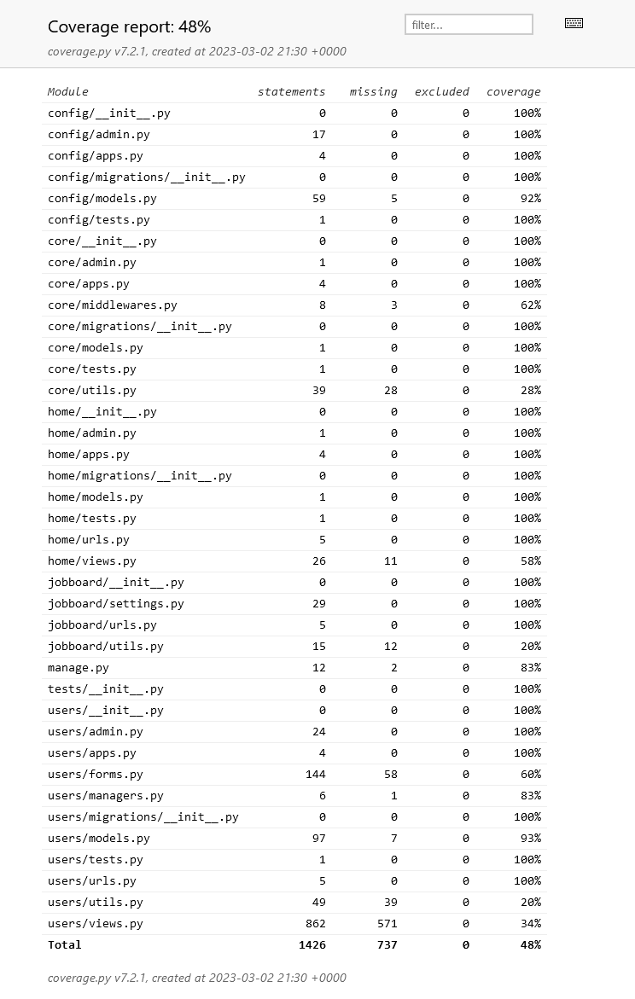

# Testing

El primer informe nos muestra:



```python
def clean_username_not_allowed(self):
    user_cache = User.objects.filter(username=self.cleaned_data["username"]).count()

    if user_cache > 0:
        if (
            self.cleaned_data["username"] == "admin"
            or self.cleaned_data["username"] == "root"
        ):
            self.add_error("username", _(f"Nombre de usuario no permitido"))
        else:
            self.add_error("username", _(f"El nombre de usuario ya existe"))
```

> Esta validación no debe ir en `users/forms.py`

## Errores
