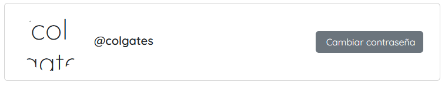

# Testing

El primer informe nos muestra:


```python
def clean_username_not_allowed(self):
    user_cache = User.objects.filter(username=self.cleaned_data["username"]).count()

    if user_cache > 0:
        if (
            self.cleaned_data["username"] == "admin"
            or self.cleaned_data["username"] == "root"
        ):
            self.add_error("username", _(f"Nombre de usuario no permitido"))
        else:
            self.add_error("username", _(f"El nombre de usuario ya existe"))
```

> Esta validación no debe ir en `users/forms.py`

## Errores

### Error al intentar subir imagen

Esto error se presenta al momento de subir una imagen en el perfil del usuario, independientemente de si el tamaño era superior o si la extensión de la imagen era la correcta


```python
for ext in fileext:
    if not file.name.endswith(ext):
        error = "Archivos permitidos: " + "; ".join(fileext)
        raise ValidationError(error)
return file
```

El código que valida la extensión lo que hacía era recorrer un arreglo con las extensiones permitidas, y en caso de que el texto no terminara en dicha extensión, saltaba el error. No obstante, la falla ocurre porque el algoritmo determina que todas las extensiones permitidas deben coincidir con la extensión del archivo; es decir, todas las validaciones deben ser verdaderas para que el algoritmo retorne que el archivo sí es válido

Esto se soluciona cambiando la condición y retornando el archivo si es verdadero. En caso contrario, el bucle debe terminar para lanzar el error de validación

```python
for ext in fileext:
    if file.name.endswith(ext):
        return file
        
error = "Archivos permitidos: " + "; ".join(fileext)
raise ValidationError(error)
```

De esta manera se corrige la falla, pero aún no se puede visualizar



Este error aparece porque django no puede determinar la ruta de la imagen a pesar de que la carpeta media (donde se almacenan los archivos) realmente existe


Esto se soluciona introduciendo la siguiente linea en urls del sitio web

```python
urlpatterns += static(settings.MEDIA_URL, document_root=settings.MEDIA_ROOT)
```
